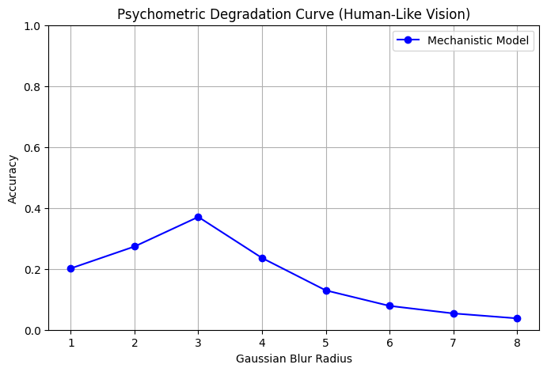
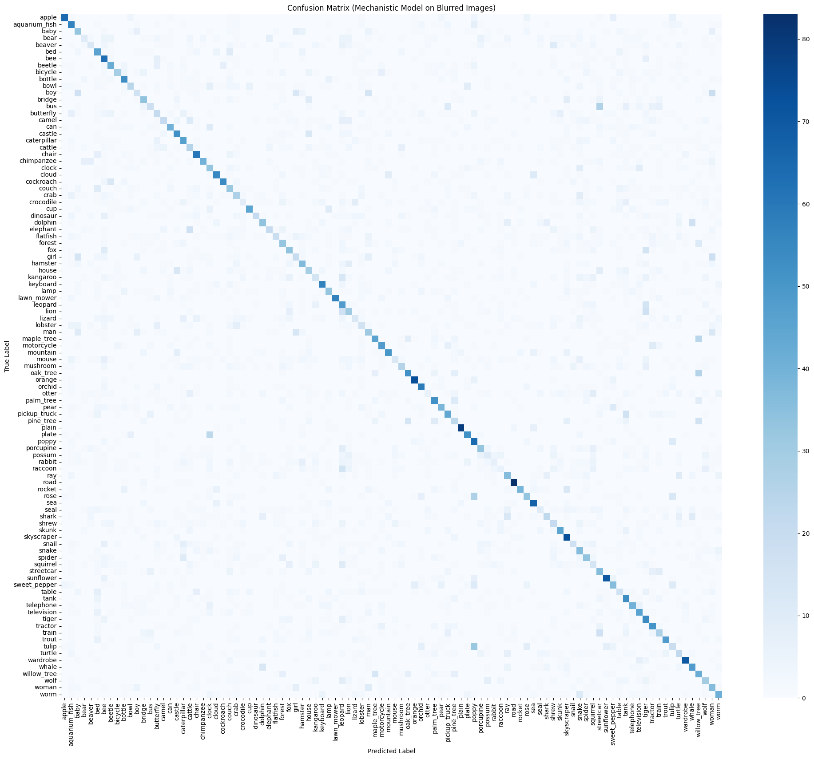
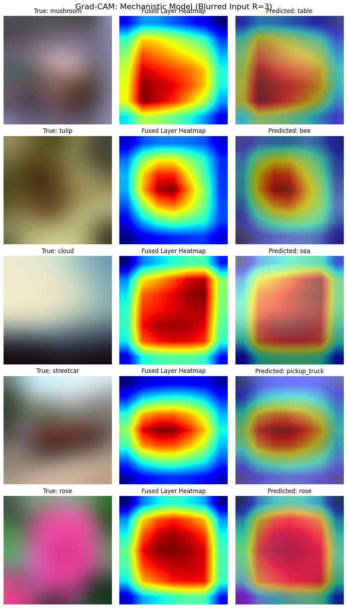
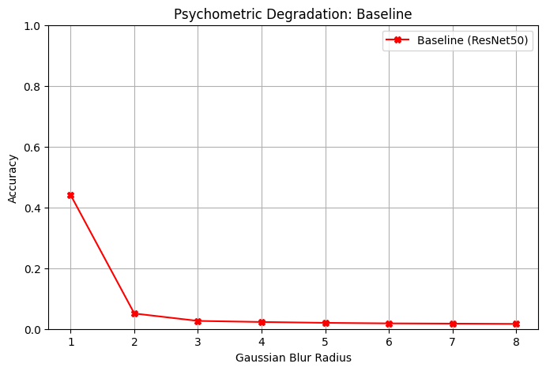
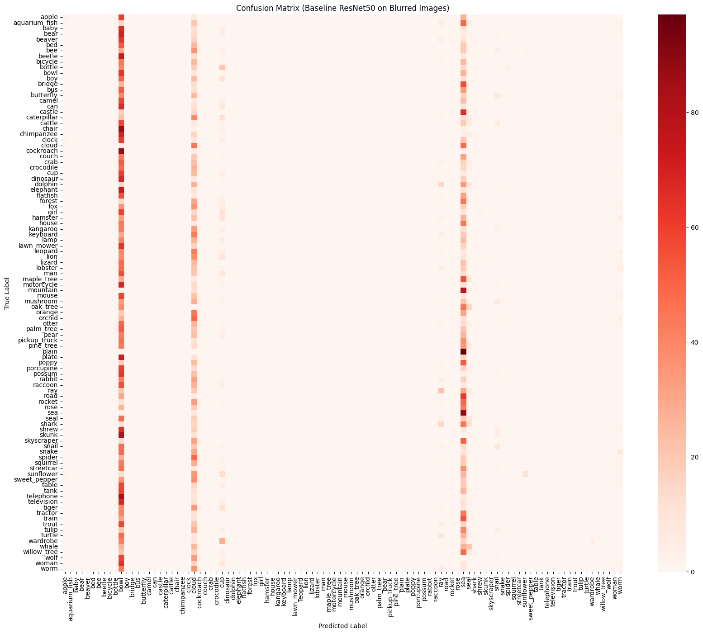
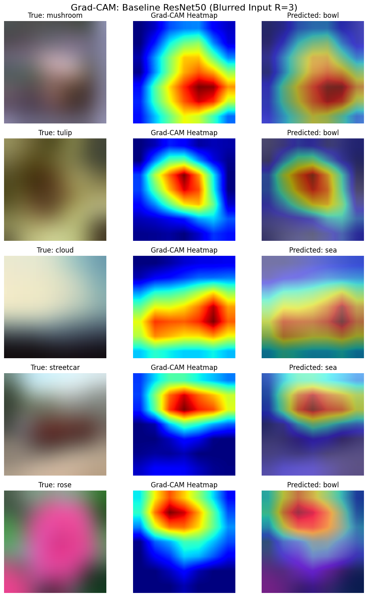
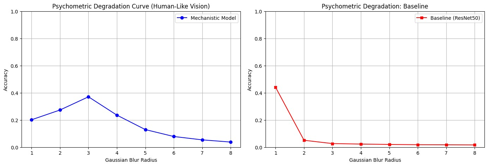
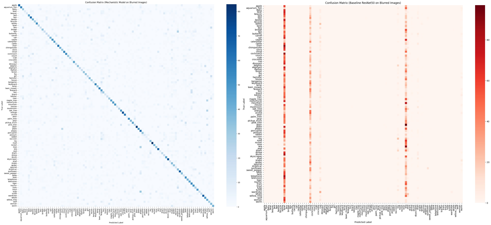
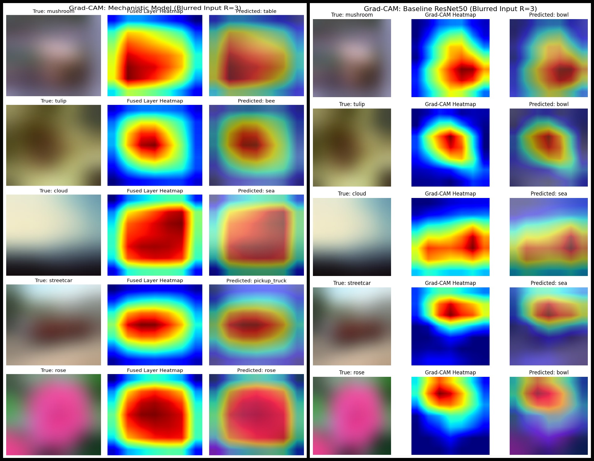

---

# CIFAR-100 Results

## Results: Mechanistic Model (CIFAR-100)

### Robustness Under Stimulus Conditions

| Condition | Accuracy |
|-----------|----------|
| **Clear** | **56.39%** |
| **Blur** | **37.05%** |
| **Sharp** | **32.24%** |

---

### Validation Images (Mechanistic)

---

## Results: Baseline ResNet50 (CIFAR-100)

### Robustness Under Stimulus Conditions

| Condition | Accuracy |
|-----------|----------|
| **Clear** | **82.42%** |
| **Blur** | **2.65%** |
| **Sharp** | **52.59%** |

---

### Validation Images (Baseline)

---

## Head-to-Head Comparison (CIFAR-100)

| Condition | Mechanistic | Baseline |
|-----------|------------|----------|
| Clear | 56.39% | 82.42% |
| Blur | **37.05%** | **2.65%** |
| Sharp | 32.24% | 52.59% |

---

### Comparison Visualizations

---

## Key Insight

- Mechanistic model is **~14× more robust under blur**
- Baseline completely collapses (2.65%)
- Confirms **shape-based + predictive coding advantage**
