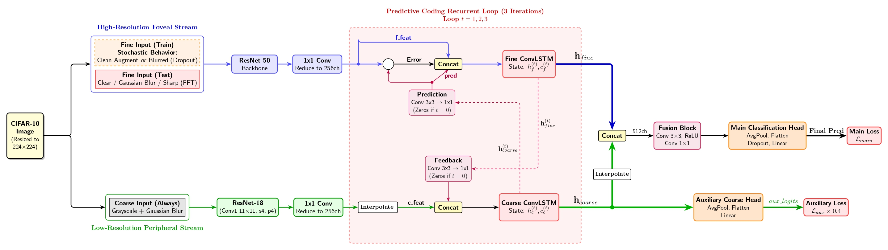
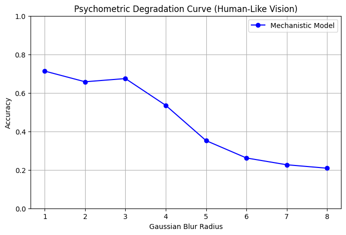
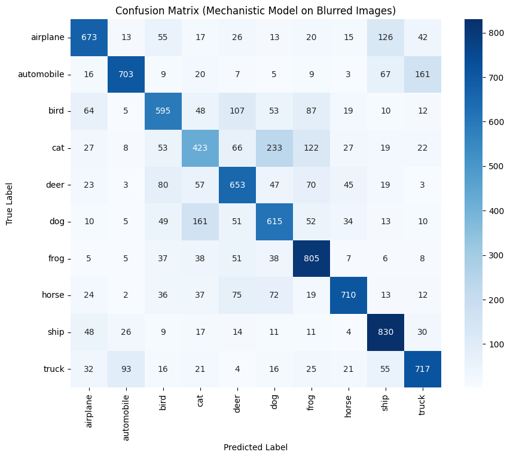
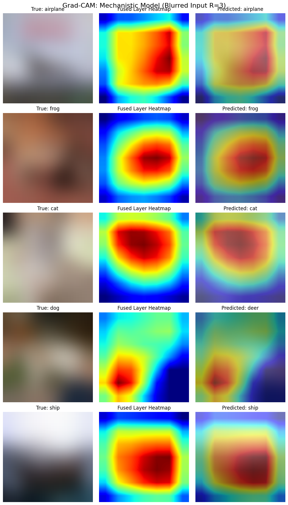
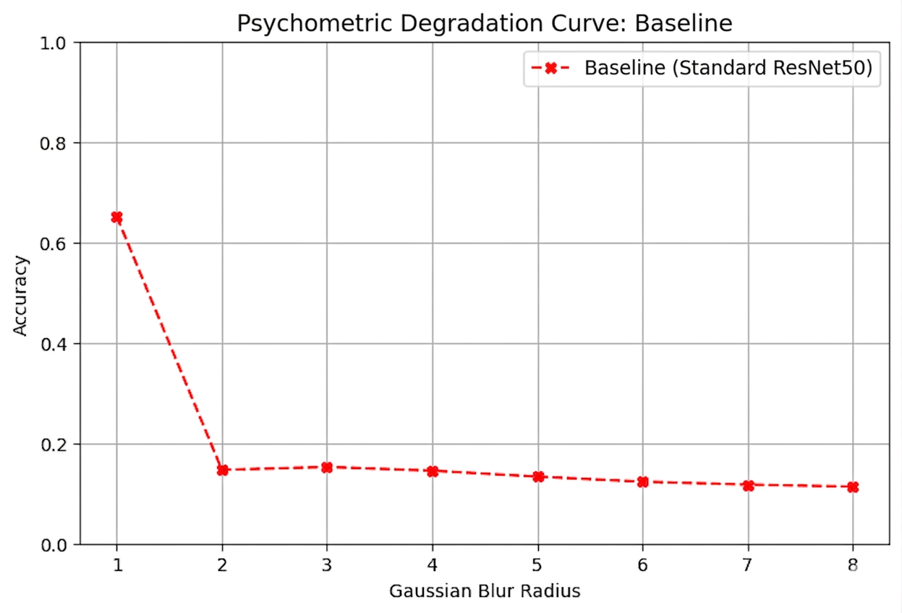
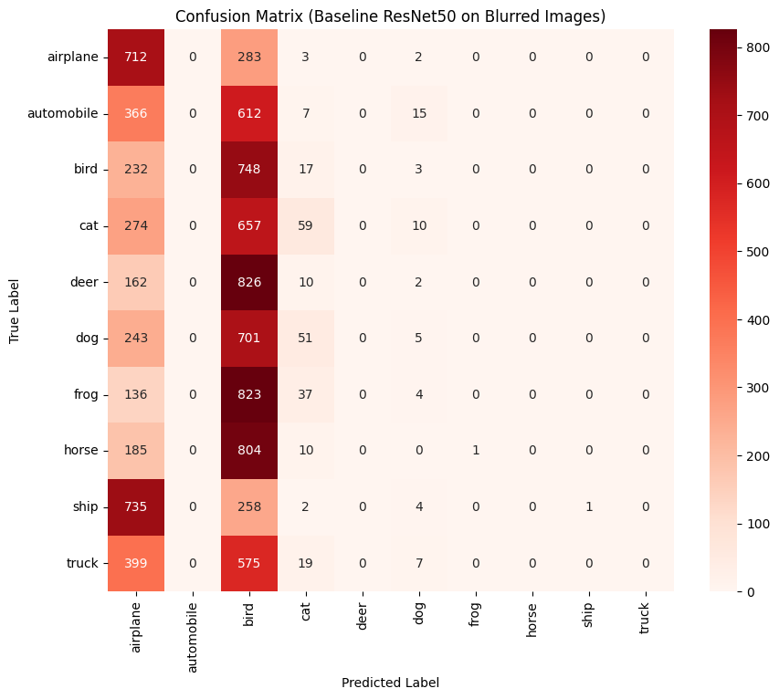
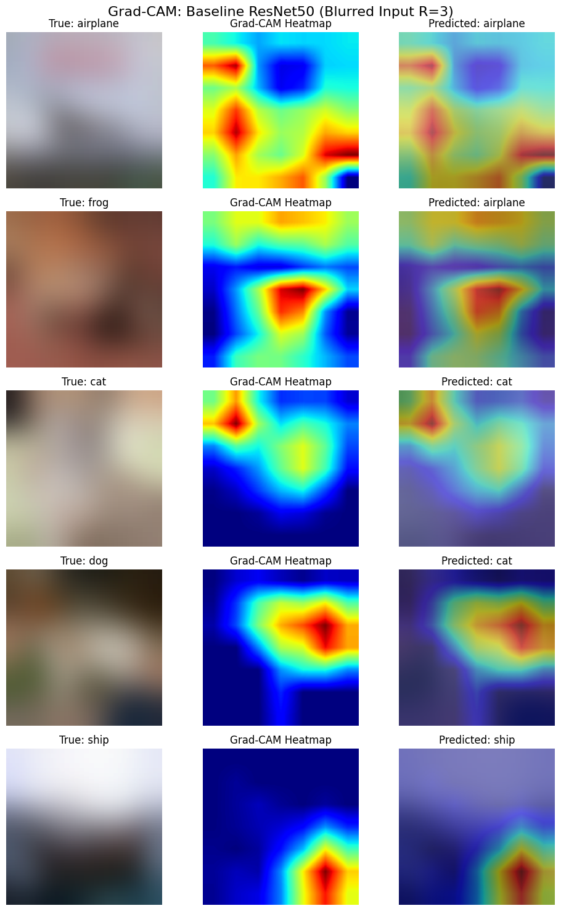
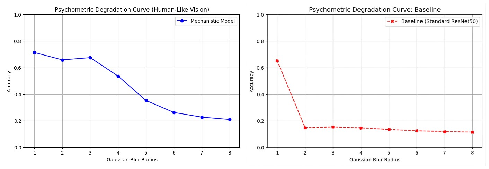
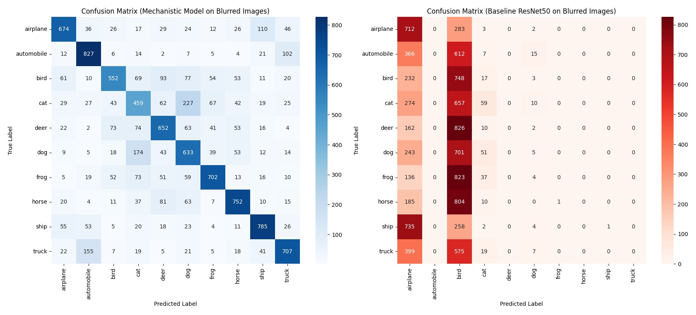
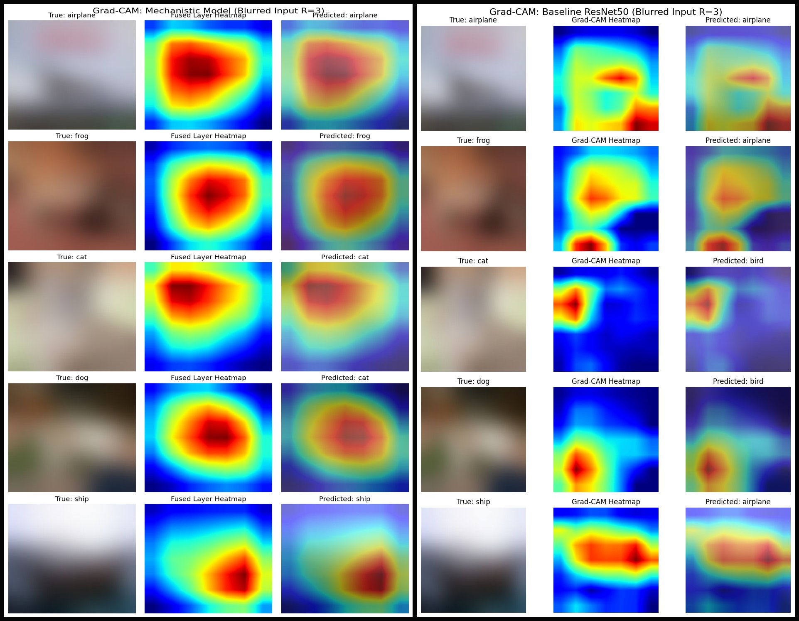

# Dual-Stream Mechanistic Vision Model

<p align="center">
  
</p>

> A neuroscience-inspired deep learning model that simulates the **Magnocellular (coarse)** and **Parvocellular (fine)** visual pathways of the human brain, connected through a **ConvLSTM-based Predictive Coding** loop — trained and evaluated on CIFAR-10.

---

## Table of Contents
- [Overview](#overview)
- [Biological Inspiration](#biological-inspiration)
- [Model Architecture](#model-architecture)
- [How the Model Thinks: The 3-Round Conversation](#how-the-model-thinks-the-3-round-conversation)
- [Key Design Choices](#key-design-choices)
- [Results: Mechanistic Model](#results-mechanistic-model)
- [Results: Baseline ResNet50](#results-baseline-resnet50)
- [Head-to-Head Comparison](#head-to-head-comparison)
- [Validation Methods](#validation-methods)
- [Project Structure](#project-structure)
- [How to Run](#how-to-run)
- [Dependencies](#dependencies)

---

## Overview

Standard convolutional neural networks (CNNs) are powerful but **fragile**. When you blur an image, they fail completely — accuracy drops to near-random guessing because they rely entirely on sharp, high-frequency texture features that blur destroys.

The human brain does not work this way. Even when your vision is blurry, foggy, or in low light, you can still recognize shapes and objects. This is because the human visual system uses **two parallel processing pathways** that work together.

This project builds a deep learning model that directly simulates those two pathways. The goal is not just to classify images — it is to prove that a **biologically-inspired architecture** is fundamentally more robust to visual degradation than a standard CNN.

**The core finding:** Under heavy blur (Gaussian Radius=3), the Mechanistic model retains **67.43% accuracy** while the ResNet50 baseline collapses to **15.25%** — a gap of over **52 percentage points**.

---

## Biological Inspiration

The human retina sends visual signals to the brain via two distinct types of neurons, each specialized for a different kind of information:

### Magnocellular Pathway (The "Coarse" Stream)
- Processes **low spatial frequency** information — big shapes, motion, rough outlines.
- It is **fast but imprecise**. It sees in low resolution, like peripheral vision.
- It is colorblind — it only processes light and dark.
- In this model: represented by a **ResNet18 backbone** receiving blurred, grayscale images.

### Parvocellular Pathway (The "Fine" Stream)
- Processes **high spatial frequency** information — fine details, textures, colors.
- It is **slow but precise**. It sees in high resolution, like foveal vision.
- In this model: represented by a **ResNet50 backbone** receiving sharp, colored images.

### Predictive Coding
In the brain, these two pathways do not just work in parallel — they **talk to each other**. The fast, blurry Magnocellular pathway makes a rough prediction of what the Parvocellular pathway is about to see. The Parvocellular pathway then sends back an error correction. This loop is called **Predictive Coding**, and it is one of the leading theories of how the human visual cortex works.

This model implements a 3-round version of this loop using **ConvLSTM cells** as the memory mechanism.

---

## Model Architecture

The model consists of the following components:

### 1. Dual Input Streams
Every image is processed as **two separate versions simultaneously**:

- **Coarse Stream input:** The image is heavily blurred (Gaussian Radius=3) and converted to grayscale. This simulates peripheral vision — blurry, colorless, but fast.
- **Fine Stream input:** The image is kept sharp with full color. This simulates foveal vision — detailed and precise.

### 2. Backbone Networks

| Stream | Backbone | Input Channels | Output Channels |
|--------|----------|---------------|-----------------|
| Coarse | ResNet18 (pretrained ImageNet) | 1 (grayscale) | 256 |
| Fine | ResNet50 (pretrained ImageNet) | 3 (RGB) | 256 |

The ResNet18's first convolution layer is modified from `kernel_size=7` to `kernel_size=11` with `stride=4`. This gives it a very large receptive field — it takes wide, sweeping glances at the image rather than focusing on tiny patches, which matches the biology of peripheral vision.

Both backbones output 256-channel feature maps after a 1×1 convolution reduction layer. They now speak the same mathematical language so they can communicate.

### 3. ConvLSTM Memory Cells
Two ConvLSTM cells act as short-term memory for each stream:

- `coarse_lstm` — receives `[coarse features + fine feedback]` → 512 input channels → 256 output
- `fine_lstm` — receives `[fine features + coarse prediction + error]` → 768 input channels → 256 output

The LSTM cell uses **4 internal gates** (Input, Forget, Output, Candidate) to decide what to remember, what to forget, and what to pass forward each round.

### 4. Communication Bridges

- `coarse_to_fine_pred`: Conv2d(3×3) → ReLU → Conv2d(1×1). Translates the coarse brain's blurry memory into a prediction of what the fine brain should be seeing. This simulates **top-down priming**.
- `fine_to_coarse_feedback`: Conv2d(3×3) → ReLU → Conv2d(1×1). Translates the fine brain's detailed memory into corrective feedback for the coarse brain. This simulates **lateral error correction**.

### 5. Fusion and Classification Head

After 3 rounds of conversation, the final memories of both streams are concatenated into a 512-channel block. This passes through:

- `fusion`: Conv2d(512→512, 3×3) → ReLU → Conv2d(512→512, 1×1)
- `head`: AdaptiveAvgPool2d → Flatten → Dropout(0.5) → Linear(512→10)
- `coarse_aux_head`: AdaptiveAvgPool2d → Flatten → Linear(256→10) *(auxiliary output to force the coarse stream to learn independently)*

---

## How the Model Thinks: The 3-Round Conversation

This is the core innovation. Rather than making a single forward pass, the model runs an iterative loop 3 times, with the two streams updating each other like two experts debating a diagnosis.

### Round 1 — First Impressions (Both memories are blank)
- The coarse stream has no prior memory, so its prediction is **a grid of zeros** — it knows nothing yet.
- The fine stream receives this zero prediction. The error is `fine_features - 0 = 100% error`.
- Both streams store their first impressions into their LSTM memory cells.
- **What was learned:** Both streams now have an initial memory. The fine stream has recorded that the coarse stream's first guess was completely wrong.

### Round 2 — The Real Conversation (Memories are active)
- The coarse stream's LSTM now has a memory of the blurry shapes. It uses `coarse_to_fine_pred` to **hallucinate** what the fine brain should be seeing — it generates a 256-channel mathematical "drawing" of its prediction.
- The fine stream subtracts this prediction from reality: `error = fine_features - prediction`. If the coarse brain correctly guessed a tire shape and the fine brain sees a tire, the error is small. If the coarse brain guessed fur and the fine brain sees metal, the error is large.
- The fine stream uses `fine_to_coarse_feedback` to send a correction message back: *"You predicted fur but I see metal edges — adjust your spatial map."*
- Both LSTMs update their memories, blending the new feedback with their old memories.
- **What was learned:** The two streams are now genuinely communicating. Predictions are becoming more accurate.

### Round 3 — Final Consensus
- The coarse brain's prediction is now refined by Round 2's feedback. The error shrinks.
- A final round of feedback is sent and memories are updated one last time.
- **What was learned:** Both streams have converged on a shared understanding of the image through biological-style predictive coding.

After Round 3, the final memories are fused together and passed to the classification head to produce the final answer.

---

## Key Design Choices

### Fine Stream Dropout (Training Trick)
During training, 50% of the time, the fine stream is **intentionally blinded** — it receives a blurred image instead of a sharp one. This forces the model to not rely entirely on perfect fine details. It must learn to extract information from the coarse stream alone, making the whole system more robust.

### Fine Stream Training Augmentation
During normal training (when dropout is not active), the fine stream receives a heavily augmented version of the image to prevent overfitting and improve generalization:

- **RandomResizedCrop** — randomly zooms in on 80–100% of the image and crops to 224×224, forcing the model to recognize objects at different scales
- **RandomHorizontalFlip** — mirrors the image 50% of the time, since a car facing left is still a car facing right
- **RandomApply GaussianBlur (p=0.5)** — applies a mild, random camera-style blur 50% of the time with variable kernel size (5–9) and sigma (0.1–2.0). This is intentionally light and is completely separate from the structural blur (radius=3) used to split the coarse stream — one is a training regularization trick, the other is the biological simulation
- **ColorJitter** — randomly shifts brightness and contrast by ±20%, simulating different lighting conditions

The coarse stream does not receive any augmentation. It always gets the same heavy structural blur (radius=3) + grayscale — its input is deterministic by design because it simulates a fixed biological property of peripheral vision, not a learned behavior.

### Auxiliary Loss
The coarse stream has its own separate classification head (`coarse_aux_head`). During training, the total loss is: loss = CrossEntropy(main_output, y) + 0.4 × CrossEntropy(coarse_output, y). 
This 40% auxiliary penalty forces the coarse stream to actually learn useful features rather than becoming a passive passenger that lets the fine stream do all the work.

### Image Frequency Transforms
Two custom signal processing transforms are used to create distinct test conditions:

**GaussianBlurTransform (radius=3):** Applies a Gaussian blur kernel. Because CIFAR-10 images are tiny (32×32 pixels), a radius of 3 covers nearly 10% of the image width per step — this is an extremely heavy blur that destroys virtually all high-frequency texture, leaving only color blobs.

**FFTHighPassTransform:** Uses the Fast Fourier Transform to decompose the image into frequency components. A circular mask removes all low-frequency components from the center of the frequency domain (smooth color gradients, shading). Only high-frequency components remain (sharp edges, outlines). The result resembles a pencil sketch of the original image.

---

## Results: Mechanistic Model
> **Note on evaluation data:** The same 10,000 CIFAR-10 test images are used both for mid-training validation (every 2 epochs) and for the final stimulus condition tests. The best model checkpoint is selected based on performance on these images. In a production setting, a separate held-out test set would be used for final evaluation to prevent any indirect data leakage.

### Robustness Under Stimulus Conditions

| Condition | Accuracy | Description |
|-----------|----------|-------------|
| **Clear** | **89.73%** | Standard, unmodified images |
| **Blur** | **67.43%** | Heavy Gaussian blur (radius=3) applied to fine stream |
| **Sharp** | **74.62%** | FFT high-pass filter — edges only |

### Per-Class Classification Report (Blur Condition, Radius=3)

| Class | Precision | Recall | F1-Score |
|-------|-----------|--------|----------|
| airplane | 0.74 | 0.67 | 0.71 |
| automobile | 0.73 | 0.83 | 0.77 |
| bird | 0.70 | 0.55 | 0.62 |
| cat | 0.48 | 0.46 | 0.47 |
| deer | 0.63 | 0.65 | 0.64 |
| dog | 0.53 | 0.63 | 0.58 |
| frog | 0.75 | 0.70 | 0.73 |
| horse | 0.73 | 0.75 | 0.74 |
| ship | 0.75 | 0.79 | 0.77 |
| truck | 0.73 | 0.71 | 0.72 |
| **Overall** | **0.68** | **0.67** | **0.67** |

**Observation:** Even under heavy blur, the model maintains strong performance on vehicles (automobile F1=0.77, ship F1=0.77) whose global shapes survive blurring. The hardest class is `cat` (F1=0.47) — cats and dogs share similar blob shapes when blurred, which is a biologically realistic confusion that humans also make.

### Validation Images

| Psychometric Curve | Confusion Matrix | Grad-CAM |
|---|---|---|
|  |  |  |

---

## Results: Baseline ResNet50

The baseline is a standard ResNet50 trained under identical conditions (same dataset split, same optimizer, same 30 epochs, same learning rate schedule) for a **fair comparison**.

### Robustness Under Stimulus Conditions

| Condition | Accuracy | Description |
|-----------|----------|-------------|
| **Clear** | **95.04%** | Standard, unmodified images |
| **Blur** | **15.25%** | Heavy Gaussian blur (radius=3) |
| **Sharp** | **82.63%** | FFT high-pass filter — edges only |

### Per-Class Classification Report (Blur Condition, Radius=3)

| Class | Precision | Recall | F1-Score |
|-------|-----------|--------|----------|
| airplane | 0.21 | 0.71 | 0.32 |
| automobile | 0.00 | 0.00 | 0.00 |
| bird | 0.12 | 0.75 | 0.21 |
| cat | 0.27 | 0.06 | 0.10 |
| deer | 0.00 | 0.00 | 0.00 |
| dog | 0.10 | 0.01 | 0.01 |
| frog | 0.00 | 0.00 | 0.00 |
| horse | 0.00 | 0.00 | 0.00 |
| ship | 1.00 | 0.00 | 0.00 |
| truck | 0.00 | 0.00 | 0.00 |
| **Overall** | **0.17** | **0.15** | **0.06** |

**Observation:** Under blur, the baseline model enters a **panic state** — it collapses to predicting only `airplane` and `bird` for almost every image regardless of the true label. This is a classic symptom of a texture-biased CNN losing its anchor when high-frequency features are destroyed.

### Validation Images

| Psychometric Curve | Confusion Matrix | Grad-CAM |
|---|---|---|
|  |  |  |

---

## Head-to-Head Comparison

### Accuracy Across All Conditions

| Condition | Mechanistic Model | ResNet50 Baseline | Difference |
|-----------|:-----------------:|:-----------------:|:----------:|
| **Clear** | 89.73% | 95.04% | -5.31% |
| **Blur** | **67.43%** | **15.25%** | **+52.18%** |
| **Sharp** | 74.62% | 82.63% | -8.01% |

### The Trade-off Explained

The mechanistic model sacrifices approximately **5% clean accuracy** in exchange for **52% blur robustness**. This is not a bug — it is the expected and scientifically sound result of a dual-stream architecture.

On clear images, ResNet50 wins because it is a larger, more specialized single-stream model optimized for clean texture processing. On blurred images, it fails completely because it has no fallback — without sharp textures, it has nothing to work with.

The mechanistic model's coarse stream acts as exactly that fallback. Even when the fine stream is blinded by blur, the coarse stream's memory of the global shape structure keeps the prediction anchored. The 3-round predictive coding loop allows the model to reason about what it should be seeing, even when direct evidence is degraded.

### Psychometric Degradation Curve Comparison



The blue curve (Mechanistic) degrades **gracefully** as blur increases — mirroring how human vision progressively loses accuracy under increasing visual noise. The red curve (Baseline) falls off a cliff at radius=2 and flatlines near random-chance performance.

### Confusion Matrix Comparison



The mechanistic confusion matrix shows a strong diagonal (correct predictions) even under blur. The baseline confusion matrix shows massive vertical columns under `airplane` and `bird`, revealing that the model is guessing the same class for nearly everything — a complete failure of semantic understanding.

### Grad-CAM Comparison



Grad-CAM visualizes **where the model is looking** when making a decision. Under blur:
- **Mechanistic model:** Attention stays centered on the object's main mass. Even when the image is an unrecognizable blob, the fused layer heatmap correctly localizes the subject.
- **Baseline model:** Attention scatters randomly — corners, background noise, and random patches. The model has no idea where to look because the texture cues it relies on are gone.

---

## Validation Methods

### 1. Psychometric Degradation Curve
Tests accuracy at Gaussian blur radii from 1 to 8. Inspired by psychophysics experiments that measure human perceptual thresholds. A biologically-inspired model should degrade smoothly (like human vision), not catastrophically.

### 2. Confusion Matrix (Blur Radius=3)
A 10×10 matrix showing which classes the model confuses with each other under blur. A healthy matrix has a strong diagonal. The mechanistic matrix maintains this structure. The baseline matrix collapses to a few dominant columns revealing panic guessing.

### 3. Grad-CAM (Gradient-weighted Class Activation Mapping)
Computes gradients of the predicted class score with respect to the final convolutional layer's activations. This produces a heatmap showing which spatial regions of the image most influenced the decision. Tested at blur radius=3 on the same 5 fixed image indices for both models to allow direct visual comparison.

---

## Project Structure

```text
Dual-Stream-Mechanistic-Vision/
├── src/                            # Source code
│   ├── mech_model/                 # Mechanistic Model scripts
│   │   ├── dual_branch_net.py      # Training script (Dual-Stream)
│   │   └── validation.py           # Evaluation and visualization 
│   └── baseline_model/             # ResNet50 Baseline scripts
│       ├── resnet50_baseline.py    # Training script (Baseline)
│       └── validation.py           # Evaluation and visualization
├── results/                        # Generated output images
│   └── comparison/
│       ├── psychometric_curve_compare.jpg
│       ├── confusion_matrix_compare.jpeg
│       └── gradcam_mechanistic_compare.jpeg
├── assets/                         # Individual model run outputs/diagrams
├── models/                         # Saved PyTorch checkpoints (.pth files)
└── README.md                       # Project documentation

---

## How to Run

### 1. Install dependencies
```bash
pip install torch torchvision tqdm matplotlib seaborn scikit-learn numpy pillow
```

### 2. Train the Mechanistic Model
```bash
python src/mech_model/dual_branch_net.py
```
This downloads CIFAR-10 automatically, trains for 30 epochs, and saves `best_model.pth`.

### 3. Run Mechanistic Validation
```bash
python src/mech_model/validation.py
```
Generates psychometric curve, confusion matrix, and Grad-CAM images.

### 4. Train the Baseline Model
```bash
python src/baseline_model/resnet50_baseline.py
```
Saves `best_baseline_model.pth`.

### 5. Run Baseline Validation
```bash
python src/baseline_model/validation.py
```

**Hardware note:** Training was done on GPU. CPU training is supported but will be significantly slower (~10x). Both scripts auto-detect available hardware.

---

## Dependencies

| Library | Version | Purpose |
|---------|---------|---------|
| PyTorch | ≥ 2.0 | Model training and inference |
| torchvision | ≥ 0.15 | ResNet backbones, CIFAR-10, transforms |
| NumPy | ≥ 1.23 | FFT transforms, array operations |
| Pillow | ≥ 9.0 | Image loading and blur filters |
| matplotlib | ≥ 3.6 | Plotting results |
| seaborn | ≥ 0.12 | Confusion matrix heatmaps |
| scikit-learn | ≥ 1.2 | Classification report metrics |
| tqdm | ≥ 4.64 | Training progress bars |

---

*Trained and evaluated on CIFAR-10. Biological pathway analogy inspired by research on the Magnocellular/Parvocellular visual system and Predictive Coding theory.*
